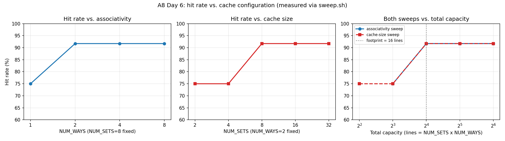
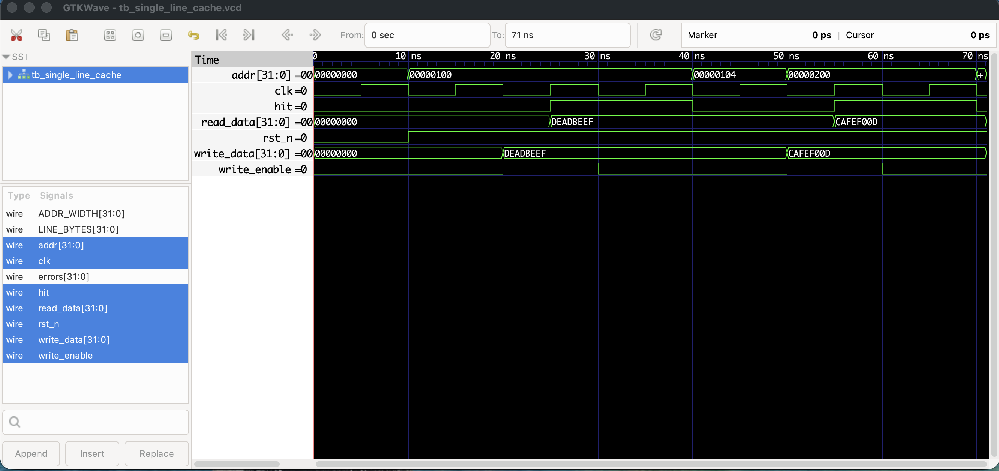

# A8 — L1 Data Cache Controller

A direct-mapped and N-way set-associative L1 data cache, written in Verilog and verified with Verilator. Built as a structured, from-scratch hardware design project — the goal was deep conceptual understanding of RTL design (module hierarchy, FSMs, memory interfaces, testbench methodology), not just a working simulation.

## Project structure

```
cache-controller/
├── rtl/
│   ├── single_line_cache.v       Day 1 — single-line cache, no index field
│   ├── address_decoder.v         tag/index/word_sel decomposition, reused everywhere
│   ├── direct_mapped_cache.v      Day 2/3 — direct-mapped, read + write, write-back
│   └── set_associative_cache.v   Day 4 — N-way set-associative, exact LRU
├── tb/
│   ├── tb_single_line_cache.v
│   ├── mem_model.v                behavioral memory stub (testbench only)
│   ├── tb_direct_mapped_cache.v
│   ├── tb_set_associative_cache.v
│   ├── tb_trace_driven.v          Day 5 — generic trace-driven testbench
│   └── trace_random1.txt          Day 5 — 192-op synthetic access trace
├── sweep.sh                       Day 6 — builds/runs a 9-point parameter sweep
├── plot_hit_rate.py                Day 6 — turns a results.csv into a plot
├── images/
│   ├── single_line_cache_waveform.png    Day 7 — GTKWave capture
│   └── hit_rate_vs_config_measured.png   Day 6 — sweep plot, committed (unlike results.csv)
├── build/                         gitignored — Verilator output, waveforms
└── README.md
```

## Address breakdown

Every address is split into three fields, computed once in `address_decoder.v` and reused by both cache designs:

```
| 31                                    0 |
+----------------+--------+--------------+
|      TAG       | INDEX  |    OFFSET    |
+----------------+--------+--------------+
```

- **OFFSET** — `$clog2(LINE_BYTES)` bits. Byte offset within a line; the top bits of this field additionally select which word within the line (`word_sel`).
- **INDEX** — `$clog2(NUM_SETS)` bits. Which set the address maps to. `single_line_cache.v` has zero index bits (exactly one line, no set concept at all).
- **TAG** — everything left over (`ADDR_WIDTH - INDEX_BITS - OFFSET_BITS`). Stored per line, compared on every access to confirm identity on a hit.

With the project's default parameters (`ADDR_WIDTH=32`, `LINE_BYTES=16`, `NUM_SETS=8`): OFFSET=4 bits, INDEX=3 bits, TAG=25 bits.

Associativity (`NUM_WAYS`) does **not** change this split — it only changes how many candidate lines exist per set. A conflict miss avoided by adding ways is not the same mechanism as a capacity miss avoided by adding sets; see the Day 6 results below for why that distinction matters.

## Policies implemented

- **Write-back** — writes only update the cache; a `dirty_array` bit per line tracks whether main memory is stale.
- **Write-allocate** — on a write miss, the line is fetched first, then the store is spliced into the just-fetched line in the same cycle (see `set_associative_cache.v`'s `S_REFILL` state).
- **Write-back on eviction, only if dirty** — a clean victim is simply overwritten; a dirty victim is drained to memory first via a dedicated `S_WRITEBACK` FSM state, verified in Day 3 by forcing an eviction and confirming the write-back log line plus a later re-fetch returning the written-back value.
- **Replacement: exact LRU via age counters** — each set's ways carry a permutation of `0..NUM_WAYS-1`; the accessed way jumps to most-recent, everything more recent than it shifts down one. Updated on every access, hit or miss-fill, not just misses. An empty (invalid) way is always preferred over evicting a valid one. See the Day 4 study PDF for why this is *exact* LRU rather than the cheaper tree-based pseudo-LRU real 4-way+ caches typically use.

## Results

**Directed trace (Days 2–4)** — a 7-step trace designed to force a conflict (two addresses aliasing to the same set):

| Cache | Hits | Misses | Hit rate |
|---|---|---|---|
| Direct-mapped | 3 | 4 | 42.9% |
| 2-way set-associative | 4 | 3 | 57.1% |

**Trace-driven (Day 5)** — 192-op synthetic trace, 3 sequential passes over a 64-word footprint:

| Cache | Hits | Misses | Hit rate | AMAT (miss penalty = 100 cycles) |
|---|---|---|---|---|
| Direct-mapped (8 sets, 1 way = 8-line capacity) | 144 | 48 | 75.0% | 26.00 cycles |
| 2-way set-associative (8 sets, 2 ways = 16-line capacity) | 176 | 16 | 91.7% | 9.33 cycles |

**Sweep (Day 6)** — measured via `sweep.sh` across 9 configurations. Headline finding: for this trace, hit rate is a function of **total capacity** (`NUM_SETS x NUM_WAYS`) alone — the associativity sweep and the cache-size sweep collapse onto the identical curve, with a hard threshold at 16 lines (the trace's footprint). Below it: 75.0% forever. At or above it: 91.7%, with zero further gain from over-provisioning. This is a different bottleneck than the Day 2–4 trace exercised (that one isolated *conflict* misses via address aliasing; this one isolates *capacity* misses via a uniform sequential scan) — two traces were needed because one trace can't reveal both stories at once.



## Waveforms



*(Captured from `tb_single_line_cache.vcd` in GTKWave.)*

## Running the simulations

All commands assume you're in the repo root and have Verilator installed (`verilator --version` to check).

```bash
# Day 1
verilator --binary --timing --trace -Wall --Wno-fatal --top-module tb_single_line_cache rtl/single_line_cache.v tb/tb_single_line_cache.v --Mdir build/obj_single_line
./build/obj_single_line/Vtb_single_line_cache

# Day 2/3 — direct-mapped
verilator --binary --timing --trace -Wall --Wno-fatal --top-module tb_direct_mapped_cache rtl/address_decoder.v rtl/direct_mapped_cache.v tb/mem_model.v tb/tb_direct_mapped_cache.v --Mdir build/obj_direct_mapped
./build/obj_direct_mapped/Vtb_direct_mapped_cache

# Day 4 — 2-way set-associative
verilator --binary --timing --trace -Wall --Wno-fatal --top-module tb_set_associative_cache rtl/address_decoder.v rtl/set_associative_cache.v tb/mem_model.v tb/tb_set_associative_cache.v --Mdir build/obj_set_assoc
./build/obj_set_assoc/Vtb_set_associative_cache

# Day 5 — trace-driven (either cache)
verilator --binary --timing --trace -Wall --Wno-fatal --top-module tb_trace_driven rtl/address_decoder.v rtl/direct_mapped_cache.v tb/mem_model.v tb/tb_trace_driven.v --Mdir build/obj_trace_direct
./build/obj_trace_direct/Vtb_trace_driven

# Day 6 — full parameter sweep
chmod +x sweep.sh && ./sweep.sh
python3 plot_hit_rate.py results.csv
```

## What this hands off to A1 (RISC-V CPU)

Confidence with module hierarchy and parameterization, the testbench-and-verify discipline (predict before you run, at both the per-op and aggregate/statistical level), and a working mental model of a memory interface and FSM behavior — exactly what the CPU's MEM stage will talk to.